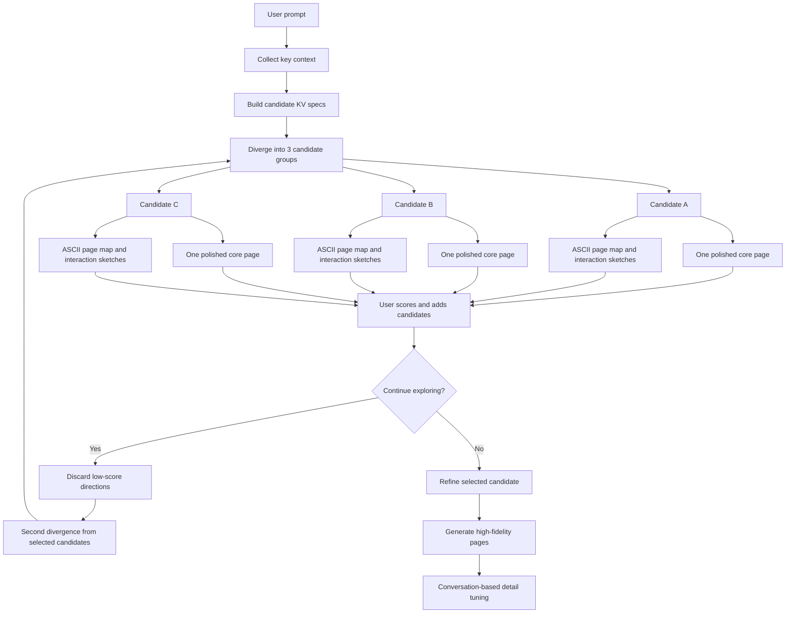

# Sketch-first Variant Exploration Flow

This document captures the proposed exploration flow for improving variant generation.
The goal is to make the first design step more divergent, cheaper to iterate, and less
likely to collapse into several pages that only differ by color.

## Core Idea

The early stage should not generate several polished final pages. It should generate
multiple candidate directions. Each candidate combines one detailed core page with
lightweight sketches for the surrounding pages and interactions.



## Candidate Output Shape

Each generated candidate should be structured enough to support both quick comparison
and later refinement.

```json
{
  "id": "candidate-a",
  "title": "Research Report Narrative",
  "hypothesis": "Use a report-like narrative to help users understand evidence and conclusions.",
  "axes": {
    "architecture": "multi-page report",
    "logic": "conclusion first, evidence later",
    "density": "medium",
    "expression": "formal research report",
    "interaction": "reading and exporting"
  },
  "primary_page": "overview",
  "page_map": ["overview", "detail", "comparison", "export"],
  "ascii_flows": [],
  "rationale": "Useful when users need to communicate findings to stakeholders.",
  "risks": ["May feel less operational for power users."],
  "status": "exploring"
}
```

## Exploration Stages

### 1. Collecting

Ask only a small set of questions before generation:

- Who will read or use this page?
- What decision or action should the page support?
- What content, data, or modules must appear?
- Should the experience lean toward reading, comparison, diagnosis, operation, or reporting?
- What styles or structures should be avoided?

### 2. Diverging

Generate three candidate groups at first. Each group should include:

- A clear design hypothesis.
- A high-fidelity core page that shows the visual direction.
- ASCII sketches for other pages, layouts, and key interactions.
- Rationale, risks, and expected use cases.

### 3. Candidate Selection

Users can score, discard, or add a direction to candidates. The next divergence should:

- Keep selected candidates.
- Remove low-score or unselected directions.
- Incorporate new user descriptions.
- Generate adjacent, opposite, or hybrid directions from selected candidates.

### 4. Refining

After a direction is selected, the goal changes from divergence to fidelity:

- Generate detailed pages for the selected direction.
- Improve layout, color, spacing, and visual details.
- Fill missing states and interactions.
- Let the user tune details through conversation.

## Divergence Axes

The axes should guide thinking instead of acting as random sampling knobs. If there
are only a few axes, the generator can consider all of them.

- Architecture: single-page, split view, workflow, dashboard, multi-page application.
- Logic: conclusion-first, process-driven, comparison-first, task-oriented, narrative.
- Density: lightweight reading, medium analysis, dense professional tooling.
- Expression: formal report, consulting deck, data product, experimental sketch, management board.
- Interaction: browsing, filtering, drilling down, annotating, exporting, collaboration.

## Why This Helps

This flow turns the generator from a page renderer into a design-space explorer. It
creates meaningful differences at the level of structure, logic, density, and interaction
before spending effort on high-fidelity implementation.
